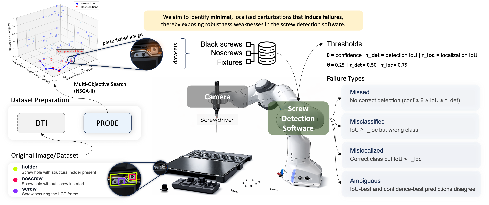

# PROBE: Search-based Robustness Testing of Laptop Refurbishing Robotic Software

---

This repository contains the implementation of **PROBE**, a multi-objective search-based approach for robustness testing of object detection models in laptop refurbishing robotic software. The approach generates **minimal and localized perturbations** to uncover failure-inducing conditions and assess model stability.

<p align="center" style="background-color:white; padding:10px; border-radius:8px;">
  
</p>

<p align="center">
    Overview of PROBE, a search-based robustness testing approach for the screw detection component in the laptop refurbishment software (DTI).
</p>

---

## Workflow

The workflow consists of three main steps:

Search (NSGA-II / Random)
        ↓
Inference (Model Evaluation)
        ↓
Analysis (RQ1, RQ2, RQ3)

---

### 1. Generate Perturbations (Search)

Run one of the following:

```bash
python algorithms/dti_nsga.py      # NSGA-II
python algorithms/dti_random.py    # Random Search (RS)
```

### 2. Run Inference (Model Evaluation)
```bash
python algorithm_inference.py
```

This step evaluates the perturbed inputs on the object detection model and produces outputs such as predictions, confidence scores, and localization metrics.

### 3. Analyse Results (RQ-based Evaluation)

Use the following scripts to reproduce the analyses from the paper:

RQ1: Effectiveness and comparison with RS

```bash
python rqs_analyses/algorithm_hv_comp_rq1.py
python rqs_analyses/failure_and_pert_comp_rq1.py
python rqs_analyses/pert_transferability_comp_rq1.py
```

RQ2: Failure type analysis

```bash
python rqs_analyses/rq2_failure_types.py
```

RQ3: Stability analysis (Metamorphic Relations)

```bash
python rqs_analyses/rq3_conf_stability.py
python rqs_analyses/rq3_loc_stability.py
```